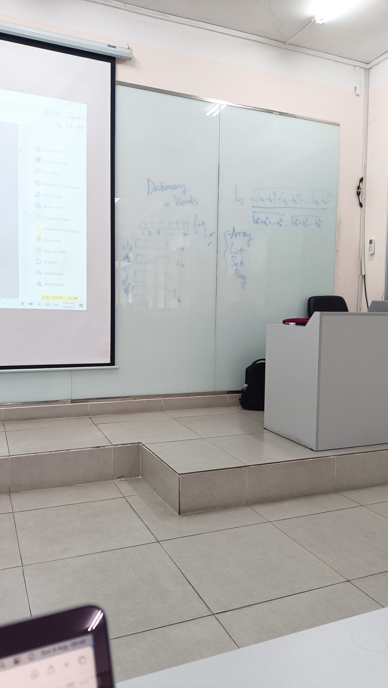
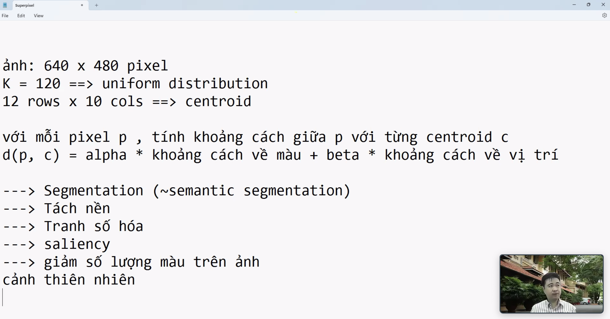
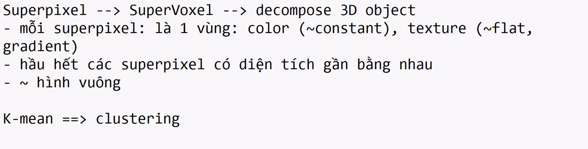
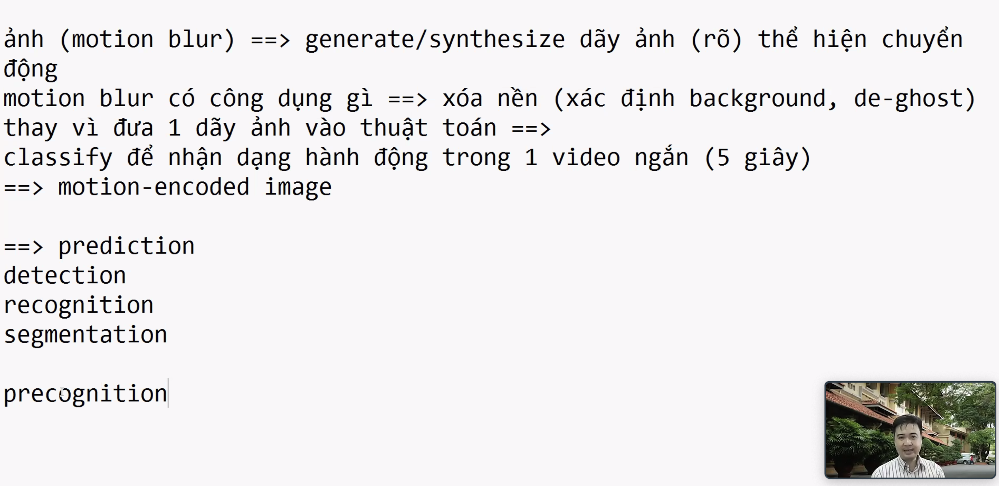

# MSc_S3: Hệ Thống Multimedia

## 300723
### Yêu cầu môn học:
Đồ án cuối kỳ:
- Làm ứng dụng
- Minh hoạ systems và có thể chạy từng phần (từng module)

Kiểm tra cuối kỳ: 
- Làm seminar =))

### Reference
Computer Vision 
- MIT Spring 2023 course: http://6.8300.csail.mit.edu/sp23/schedule.html

Computational Photography
- UIUC Fall 2022: https://courses.engr.illinois.edu/cs445/fa2022/

Information Retrieval:

Multimedia Forensics: 
- Bài toán: Out-of-context

Giới thiệu dataset: 
- Place 365 (MIT): dùng để tạo video, lồng nhạc dô =))

Stable Diffusion => synthesize

### Nội dung chi tiết
#### Giới thiệu Xử lý ảnh
Một số ứng dụng:
 - 
 - visual creation
 - impainting

Electromagnetic spectrum:
- màu mà ta gọi tên là chỗ có nhiều photon bước sóng tương ứng -- Hue (H)
- màu bị trộn lẫn bởi những cái khác -- Saturation (S)
- Tổng số lượng photon tại đó -- Lightness (L), Intensity (I), Value (V)
Hệ màu:
- RGB
- HSV/HSL/HSI

Filters
- Sensor array
I = (R + G + B)/3

I = 0.3R + 0.59G + 0.11B

Pixel privacy => MediaEval: Đánh lừa các classifier của deeplearning =))

Filter vs. Warp
- filter: h(f(x)), có 2 dạng filter:
    1. Spatial filter
    2. Frequency 
- Một số filter:
    - box filter: dùng để smoothing (triệt tiêu/giảm sự khác biệt quá đáng của điểm đang xét với các điểm xung quanh)
    - median filter: tính trung bình cộng làm lan truyền sự khác biệt sang các điểm xung. Vì thế, ta dùng median, đầu tiên ta sắp lại theo tăng dần hoặc giảm dần điểm đang xét và các điểm lân cận và loại bỏ điểm oulier nếu có => thường dùng để lại nhiễu cho các ảnh bị muối tiêu
    - linear filter
    - sharpening filter
    - sobel filter: lọc biên cạnh (ngang/dọc), thằng nào gần nghe nó nhiều hơn =))
    - prewitt filter: lấy phiếu bầu đều nhau
    - gaussian filter: làm mượt dữ liệu, nghe thằng gần hơn nhưng với phân phối gauss 

Ảnh làm mờ (trơn): 
high pass: ảnh gốc trừ ảnh mờ -- còn lại 
high-boost: ảnh còn nội dung, chỉ làm sắc nét, tăng cường nét chi tiết trong ảnh --> dùng cho tiền xử lý dữ liệu trước khi đưa vào các thuật toán deep learning
    
- warp: f(h(x))

Giới thiệu một số project trong UIUC course:
- project 1: Hybird images (trộn ảnh)
- project 2: Image quilting
- project 3: gradient domain fus 
- camouflage object detection

vector gradient:
- 

saliency detection

seam carving: dùng để resize ảnh, dùng khá ổn trên ảnh phong cảnh, tuy nhiên không thực sự tốt khi có ảnh mặt người -> dùng penalty để đánh phạt các vùng không được động đến

- Tuần sau học cn 8h C22

## 060823
## Visual Bags of Words (Standford - Lecture 12-1)

Ref. [Visual Bags of Words](http://vision.stanford.edu/teaching/cs131_fall1718/files/14_BoW_bayes.pdf)

Bài toán truy vấn thông tin 
- truy vấn
- sắp hạng

### Giới thiệu về Bags of Words (BoW)
- xuất phát từ bài toán phân loại văn bản
- dựa trên các keyword và số lượng xuất hiện của chúng để phân loại
- mỗi chủ đề chọn một tập các từ/ngữ (từ điển của chủ đề đó)
- trong một văn bản, đếm số lần xuất hiện các keywords -> chuẩn hoá về một vector thể hiện tần suất xuất hiện các keyword có trong từ điển của chủ đề đó
- dùng độ đo l_2 (độ đo Euclide) để đo khoảng cách giữa 2 vector, dùng label của vector có khoảng cách ngắn nhất so với vector của văn bản đang xét để làm nhãn của nó.

Lưu trữ dữ liệu
- Array: có thứ tự, có thể truy cập ngẫu nhiên dựa vào index của nó
- List: có thứ tự , không truy cập ngẫu nhiên vì phải đi qua k-1 phần tử trước nó
- Set: không có thứ tự, một item là unique
- Bag: không có thứ tự, một item có thể xuất hiện nhiều lần

Bài toán classification nhưng dùng k láng giềng gần -> bài toán retrieval

### Ứng dụng BoW trên ảnh

Origin 1: Texture Recognition
- dùng số lẻ khi cắt ảnh ví dụ 3x3 vì hi vọng có tâm ở giữa và đối xứng tâm
- tương tự như NLP, ảnh ta chọn các texture, các chủ đề (trong nhà, ngoài trời,..) và các mảnh ảnh mẫu (visual words) -> tạo ra tự điển ảnh

Cách dùng:
- lên github -> kiếm code dễ chạy -> kiếm code mới nhất trong đống dễ chạy -> chạy thử và lấy cái có kết quả ngon =))

Giới thiệu bài toán re-identification trên vehicle dataset: là một ứng dụng thực tế của BoW trên ảnh, ví dụ định danh xe gây án khi đã bỏ đi biển số xe
- Dataset: VeRi-776

Các cách lấy mẫu:
- Dense sampling: ví dụ với ảnh 100x100, chia 20 -> 81x81 mảnh ảnh -> ảnh 4k ngủm =))
- Sparse sampling
    - uniform: dùng strike để nhảy và lấy mẫu (vẫn trượt hết ảnh)
    - random: lấy đại =)) 
    
Nếu lấy mẫu tại các vùng có ý nghĩa quan trọng trong bức ảnh (ill-posed, vì ý tưởng tốt nhưng khó định nghĩa chính xác) -> lấy mảnh thường được chú ý bởi đa số -> dùng Saliency Algo

Bài toán nhận dạng chữ ký dùng BoW
- bao nhiêu mảnh là đủ
- cắt vùng nào 
- dùng k-means clustering
- dùng normalization do chữ kỹ có thể xoay ngang, 5-7 độ các thứ -> nếu lấy ngang -> thế nào là ngang -> dùng gradient
- dùng gradient: lấy vector gradient cho tất cả các mảnh của ảnh, dùng đặc trưng SIFT
- giới thiệu SIFT feature, tính gradient của các mảnh có trong ảnh, các vector bỏ phiếu vào các góc hướng dựa theo độ lớn của nó, vector có độ lớn lớn, biến thiên nhiều thì có ảnh hưởng lớn

Giới thiệu [BLIP-2](https://www.google.com/url?sa=t&rct=j&q=&esrc=s&source=web&cd=&cad=rja&uact=8&ved=2ahUKEwi0yMbX-saAAxUHmFYBHVQNAYEQFnoECA0QAQ&url=https%3A%2F%2Farxiv.org%2Fabs%2F2301.12597&usg=AOvVaw2g7SMroGbdgIzcw-_xlCAO&opi=89978449) -- code có sẵn, tìm ko ra tìm hỏi thầy Đăng hoặc thầy Lễ 

Bài toán scatch recognition and classification
- tương tự như nhận dạng và phân loại chữ ký

Cuộc thi TREC VID được tổ chức hằng năm bởi NIST
- Adhoc Video Search (AVS): có nhiều cách khác nhau đưa keywords query vào, và retrieve ra kết quả
- giới thiệu cách tiếp cận cổ điển: W2VV
- giới thiệu cách tiếp cận so sánh ảnh và text khi truy vấn: CLIP 

### Digital Twin Intro - Prof. Cathal Gurrin
- lifelog search challenge topic: lifelog search engine
- [loggerman](http://loggerman.org/)
- support for quatified-self to enhance performance, health-care, knowledge support
- intro a epidemiological studies: Kidscam for bad food/diet habits survey
- intro SenseCam (microsoft 2002), using SVM and theshold to segment data
- intro [EyeAware](https://www.eyeaware.org/)
- challenges
    - limit of dataset (due to privacy, eg. a month of life record :'>) -> self-record :<
- Digital Twin dataset (18 month)

Dataset preparation
- data anno. process
-
-
-

the flow 
1. know item:  
2. adhoc
3. Q&A: retrieve and answer specific question

## 120823

Giới thiệu biến đổi Fourier và miền tần số

Biến đổi Fourier (từ tín hiệu về các hàm sin)

Biến đổi Fourier nghịch (hàm cơ sở về tín hiệu)

Wavelet

high-pass thể hiện các chi tiết

low-pass thể hiện 

Sử dụng xử lý tín hiệu số cho detect các đối tượng khó phân tách trong xử lí ảnh y khoa -> *thử dùng để tách vùng bất thường trong ảnh*

Khi segment, thử tách A và phi trong tín hiệu ra, giữ lại phi để dữ lại dáng đối tượng

Fourier trong dự đoán giá cổ phiếu =)))

### Histogram and Color Balance

Color space:
- RGB
- HSV

Histogram: đếm tần suất xuất hiện các giá trị màu

Histogram equalization

Histogram specification

=> Dùng hisogram để phân biệt các logo gần giống nhau để kiểm định logo lúc đăng kí logo ~ list được các logo gần giống nhau

Giới thiệu image pyramid: chia ra nhiều vùng gồm nhiều level khác nhau @@
- [GraphCut](https://github.com/NathanZabriskie/GraphCut)

Giới thiệu Segmentation:
- Semantic
- Intance

Blending:
- Poison blending (2003) chạy nhanh và ổn, cơ chế: cắt dán vector gradient -> giữ lại vector gradient của đối tượng thay vì giữ lại màu, kết quả khá tự nhiên nhưng đổ bóng sẽ bị sai do hướng đổ bóng bị đổi do ảnh hưởng của việc áp gradient của đối tượng lên nền

Dặn dò: Triển khai một công cụ để visual search 
- năm ngoái dùng [fiftyone](https://docs.voxel51.com/)
- hội nghị RIVF23 vẫn còn đang nhận bài đợt 2 :'> (deadline 30.08)
- hội nghị SOICT 2023 (deadline 05.09 có thể kéo đến 15) -- có 1 track dễ nộp bài: lifelog event retrieval
- t7 26.08: bảo vệ luận chương trình tiên tiến, hội đồng ngon nên đi dự :v

## 200823
 Giới thiệu superpixel 
 

 https://courses.engr.illinois.edu/cs445/fa2022/lectures/Lecture%2019%20-%20Object%20Recognition%20and%20Augmented%20Reality%20-%20Online.pptx

https://openaccess.thecvf.com/content_cvpr_2018/papers/Jin_Learning_to_Extract_CVPR_2018_paper.pdf

## Final project - Mobile image retrieval app
[MobileNetV3](https://keras.io/api/applications/mobilenet/)

