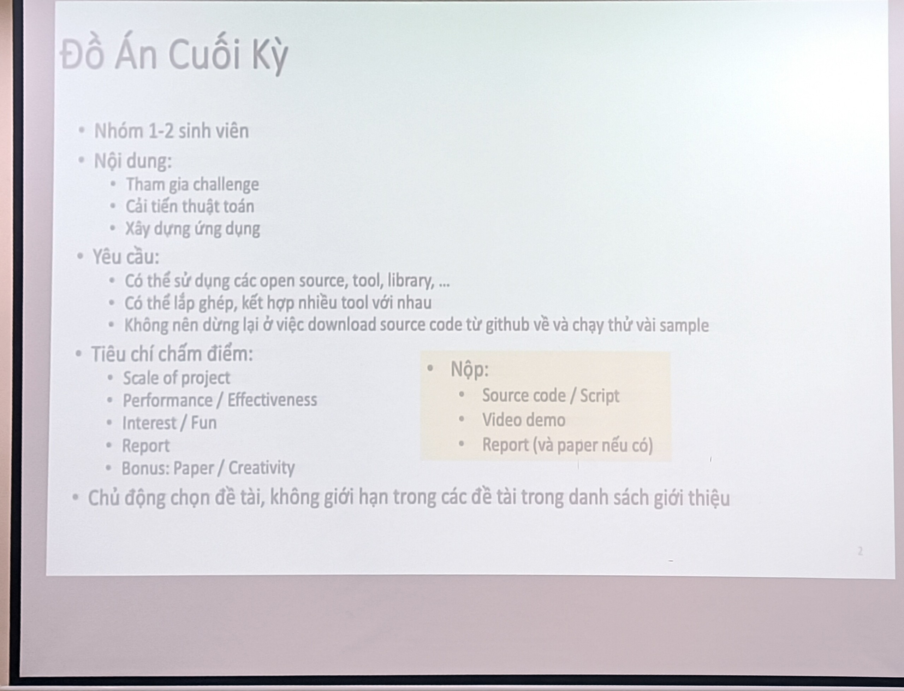
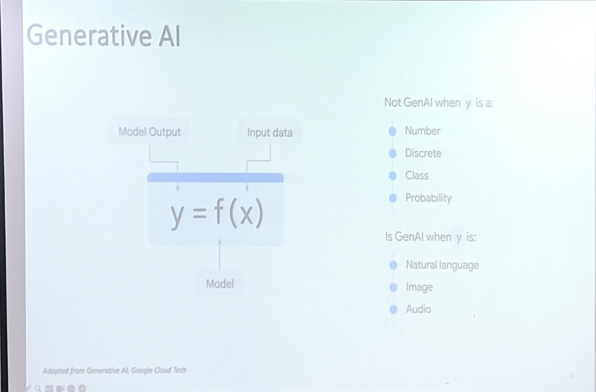
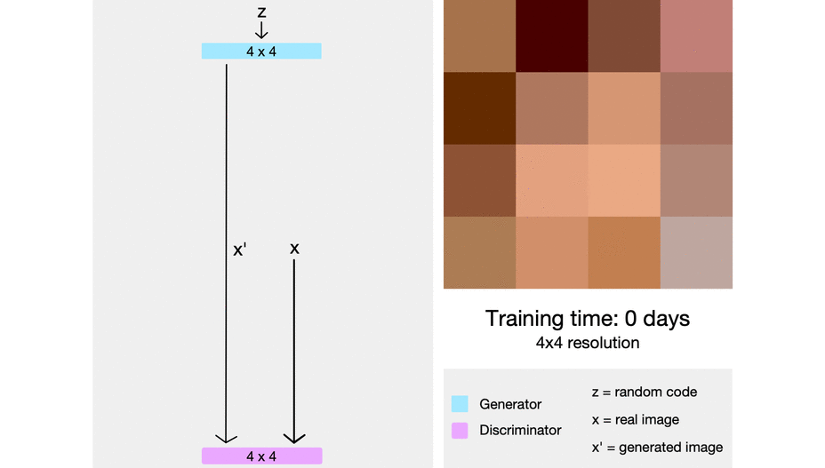
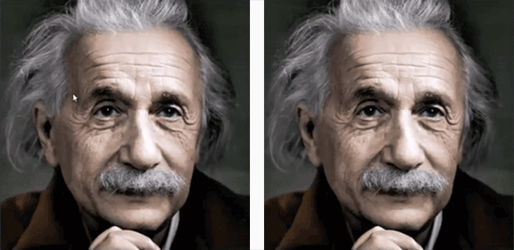

# MSc_S3: Hệ Thống Multimedia

## 300723
### Yêu cầu môn học:
Đồ án cuối kỳ:
- Làm ứng dụng
- Minh hoạ systems và có thể chạy từng phần (từng module)

Kiểm tra cuối kỳ: 
- Làm seminar =))

### Reference
Computer Vision 
- MIT Spring 2023 course: http://6.8300.csail.mit.edu/sp23/schedule.html

Computational Photography
- UIUC Fall 2022: https://courses.engr.illinois.edu/cs445/fa2022/

Information Retrieval:

Multimedia Forensics: 
- Bài toán: Out-of-context

Giới thiệu dataset: 
- Place 365 (MIT): dùng để tạo video, lồng nhạc dô =))

Stable Diffusion => synthesize

### Nội dung chi tiết
#### Giới thiệu Xử lý ảnh
Một số ứng dụng:
 - 
 - visual creation
 - impainting

Electromagnetic spectrum:
- màu mà ta gọi tên là chỗ có nhiều photon bước sóng tương ứng -- Hue (H)
- màu bị trộn lẫn bởi những cái khác -- Saturation (S)
- Tổng số lượng photon tại đó -- Lightness (L), Intensity (I), Value (V)
Hệ màu:
- RGB
- HSV/HSL/HSI

Filters
- Sensor array
I = (R + G + B)/3

I = 0.3R + 0.59G + 0.11B

Pixel privacy => MediaEval: Đánh lừa các classifier của deeplearning =))

Filter vs. Warp
- filter: h(f(x)), có 2 dạng filter:
    1. Spatial filter
    2. Frequency 
- Một số filter:
    - box filter: dùng để smoothing (triệt tiêu/giảm sự khác biệt quá đáng của điểm đang xét với các điểm xung quanh)
    - median filter: tính trung bình cộng làm lan truyền sự khác biệt sang các điểm xung. Vì thế, ta dùng median, đầu tiên ta sắp lại theo tăng dần hoặc giảm dần điểm đang xét và các điểm lân cận và loại bỏ điểm oulier nếu có => thường dùng để lại nhiễu cho các ảnh bị muối tiêu
    - linear filter
    - sharpening filter
    - sobel filter: lọc biên cạnh (ngang/dọc), thằng nào gần nghe nó nhiều hơn =))
    - prewitt filter: lấy phiếu bầu đều nhau
    - gaussian filter: làm mượt dữ liệu, nghe thằng gần hơn nhưng với phân phối gauss 

Ảnh làm mờ (trơn): 
high pass: ảnh gốc trừ ảnh mờ -- còn lại 
high-boost: ảnh còn nội dung, chỉ làm sắc nét, tăng cường nét chi tiết trong ảnh --> dùng cho tiền xử lý dữ liệu trước khi đưa vào các thuật toán deep learning
    
- warp: f(h(x))

Giới thiệu một số project trong UIUC course:
- project 1: Hybird images (trộn ảnh)
- project 2: Image quilting
- project 3: gradient domain fus 
- camouflage object detection

vector gradient:
- 

saliency detection

seam carving: dùng để resize ảnh, dùng khá ổn trên ảnh phong cảnh, tuy nhiên không thực sự tốt khi có ảnh mặt người -> dùng penalty để đánh phạt các vùng không được động đến

- Tuần sau học cn 8h C22

## 060823
## Visual Bags of Words (Standford - Lecture 12-1)

Ref. [Visual Bags of Words](http://vision.stanford.edu/teaching/cs131_fall1718/files/14_BoW_bayes.pdf)

Bài toán truy vấn thông tin 
- truy vấn
- sắp hạng

### Giới thiệu về Bags of Words (BoW)
- xuất phát từ bài toán phân loại văn bản
- dựa trên các keyword và số lượng xuất hiện của chúng để phân loại
- mỗi chủ đề chọn một tập các từ/ngữ (từ điển của chủ đề đó)
- trong một văn bản, đếm số lần xuất hiện các keywords -> chuẩn hoá về một vector thể hiện tần suất xuất hiện các keyword có trong từ điển của chủ đề đó
- dùng độ đo l_2 (độ đo Euclide) để đo khoảng cách giữa 2 vector, dùng label của vector có khoảng cách ngắn nhất so với vector của văn bản đang xét để làm nhãn của nó.

Lưu trữ dữ liệu
- Array: có thứ tự, có thể truy cập ngẫu nhiên dựa vào index của nó
- List: có thứ tự , không truy cập ngẫu nhiên vì phải đi qua k-1 phần tử trước nó
- Set: không có thứ tự, một item là unique
- Bag: không có thứ tự, một item có thể xuất hiện nhiều lần

Bài toán classification nhưng dùng k láng giềng gần -> bài toán retrieval

### Ứng dụng BoW trên ảnh

Origin 1: Texture Recognition
- dùng số lẻ khi cắt ảnh ví dụ 3x3 vì hi vọng có tâm ở giữa và đối xứng tâm
- tương tự như NLP, ảnh ta chọn các texture, các chủ đề (trong nhà, ngoài trời,..) và các mảnh ảnh mẫu (visual words) -> tạo ra tự điển ảnh

Cách dùng:
- lên github -> kiếm code dễ chạy -> kiếm code mới nhất trong đống dễ chạy -> chạy thử và lấy cái có kết quả ngon =))

Giới thiệu bài toán re-identification trên vehicle dataset: là một ứng dụng thực tế của BoW trên ảnh, ví dụ định danh xe gây án khi đã bỏ đi biển số xe
- Dataset: VeRi-776

Các cách lấy mẫu:
- Dense sampling: ví dụ với ảnh 100x100, chia 20 -> 81x81 mảnh ảnh -> ảnh 4k ngủm =))
- Sparse sampling
    - uniform: dùng strike để nhảy và lấy mẫu (vẫn trượt hết ảnh)
    - random: lấy đại =)) 
    
Nếu lấy mẫu tại các vùng có ý nghĩa quan trọng trong bức ảnh (ill-posed, vì ý tưởng tốt nhưng khó định nghĩa chính xác) -> lấy mảnh thường được chú ý bởi đa số -> dùng Saliency Algo

Bài toán nhận dạng chữ ký dùng BoW
- bao nhiêu mảnh là đủ
- cắt vùng nào 
- dùng k-means clustering
- dùng normalization do chữ kỹ có thể xoay ngang, 5-7 độ các thứ -> nếu lấy ngang -> thế nào là ngang -> dùng gradient
- dùng gradient: lấy vector gradient cho tất cả các mảnh của ảnh, dùng đặc trưng SIFT
- giới thiệu SIFT feature, tính gradient của các mảnh có trong ảnh, các vector bỏ phiếu vào các góc hướng dựa theo độ lớn của nó, vector có độ lớn lớn, biến thiên nhiều thì có ảnh hưởng lớn

Giới thiệu [BLIP-2](https://www.google.com/url?sa=t&rct=j&q=&esrc=s&source=web&cd=&cad=rja&uact=8&ved=2ahUKEwi0yMbX-saAAxUHmFYBHVQNAYEQFnoECA0QAQ&url=https%3A%2F%2Farxiv.org%2Fabs%2F2301.12597&usg=AOvVaw2g7SMroGbdgIzcw-_xlCAO&opi=89978449) -- code có sẵn, tìm ko ra tìm hỏi thầy Đăng hoặc thầy Lễ 

Bài toán scatch recognition and classification
- tương tự như nhận dạng và phân loại chữ ký

Cuộc thi TREC VID được tổ chức hằng năm bởi NIST
- Adhoc Video Search (AVS): có nhiều cách khác nhau đưa keywords query vào, và retrieve ra kết quả
- giới thiệu cách tiếp cận cổ điển: W2VV
- giới thiệu cách tiếp cận so sánh ảnh và text khi truy vấn: CLIP 

### Digital Twin Intro - Prof. Cathal Gurrin
- lifelog search challenge topic: lifelog search engine
- [loggerman](http://loggerman.org/)
- support for quatified-self to enhance performance, health-care, knowledge support
- intro a epidemiological studies: Kidscam for bad food/diet habits survey
- intro SenseCam (microsoft 2002), using SVM and theshold to segment data
- intro [EyeAware](https://www.eyeaware.org/)
- challenges
    - limit of dataset (due to privacy, eg. a month of life record :'>) -> self-record :<
- Digital Twin dataset (18 month)

Dataset preparation
- data anno. process
-
-
-

the flow 
1. know item:  
2. adhoc
3. Q&A: retrieve and answer specific question

## 120823

Giới thiệu biến đổi Fourier và miền tần số

Biến đổi Fourier (từ tín hiệu về các hàm sin)

Biến đổi Fourier nghịch (hàm cơ sở về tín hiệu)

Wavelet

high-pass thể hiện các chi tiết

low-pass thể hiện 

Sử dụng xử lý tín hiệu số cho detect các đối tượng khó phân tách trong xử lí ảnh y khoa -> *thử dùng để tách vùng bất thường trong ảnh*

Khi segment, thử tách A và phi trong tín hiệu ra, giữ lại phi để dữ lại dáng đối tượng

Fourier trong dự đoán giá cổ phiếu =)))

### Histogram and Color Balance

Color space:
- RGB
- HSV

Histogram: đếm tần suất xuất hiện các giá trị màu

Histogram equalization

Histogram specification

=> Dùng hisogram để phân biệt các logo gần giống nhau để kiểm định logo lúc đăng kí logo ~ list được các logo gần giống nhau

Giới thiệu image pyramid: chia ra nhiều vùng gồm nhiều level khác nhau @@
- [GraphCut](https://github.com/NathanZabriskie/GraphCut)

Giới thiệu Segmentation:
- Semantic
- Intance

Blending:
- Poison blending (2003) chạy nhanh và ổn, cơ chế: cắt dán vector gradient -> giữ lại vector gradient của đối tượng thay vì giữ lại màu, kết quả khá tự nhiên nhưng đổ bóng sẽ bị sai do hướng đổ bóng bị đổi do ảnh hưởng của việc áp gradient của đối tượng lên nền

Dặn dò: Triển khai một công cụ để visual search 
- năm ngoái dùng [fiftyone](https://docs.voxel51.com/)
- hội nghị RIVF23 vẫn còn đang nhận bài đợt 2 :'> (deadline 30.08)
- hội nghị SOICT 2023 (deadline 05.09 có thể kéo đến 15) -- có 1 track dễ nộp bài: lifelog event retrieval
- t7 26.08: bảo vệ luận chương trình tiên tiến, hội đồng ngon nên đi dự :v

## 200823
 Giới thiệu superpixel 
 

 https://courses.engr.illinois.edu/cs445/fa2022/lectures/Lecture%2019%20-%20Object%20Recognition%20and%20Augmented%20Reality%20-%20Online.pptx

https://openaccess.thecvf.com/content_cvpr_2018/papers/Jin_Learning_to_Extract_CVPR_2018_paper.pdf

## 270823
Trí tuệ nhân tạo và phát sinh nội dung (AI and Generative AI)

Mis-information: hiểu nhầm, hiểu sai về một câu văn nào đó hoặc vấn đề nào đó - thông tin không đầy đủ, không chính xác một cách không có chủ đích (vô tình)

Dis-information: thông tin không đầy đủ, không chính xác một cách có chủ đích

Giới thiệu DeepFakeApp

Một số từ khoá: DeepFake, Faceswap (dán gương mặt người này vào vùng gương mặt người khác (texture)), face reenactment (dán chuyển động trên gương mặt)

Một số bài toán phát hiện deepfake đang chuyển sang gợi ý bất thường trong video hay hình ảnh. Nhưng vẫn gặp một số thách thức như mặt thật nhưng cà app nhiều quá, hoặc gắn thêm filter, backgound các thứ. 

Một số bài toán:
- openforensics: https://sites.google.com/view/ltnghia/research/openforensics?utm_source=zalo&utm_medium=zalo&utm_campaign=zalo
    - xác định thanh media của video đang chạy =))
    - xác định các đốm sáng và dải sáng phản chiếu do sử dụng các thiết bị điện tử để để ảnh lên và replace
- Image Realistic
- Image ballistic: 
    - reverse image search: tìm xem một hình ảnh đã từng xuất hiện trong các bài post (kể cả đã xoá)
- File forensics: https://namesleuth.fotoverifier.eu/
    - source tracing
        - cryp analysis
    - filename inspection
    - existence confirmation
    - additional information

Giới thiệu CheapFake
- dùng hình thật nhưng đưa tin theo ngữ cảnh khác không giống với mục đích ban đầu, gọi là out-of-context (OOC)
- bài toán: có ít nhất 2 bài post chứa bức ảnh thật đang có nhưng nội dung khác nhau -> gợi ý có bất ổn
- Từ khoá: COSMOS - paper cho bài toán cơ bản của cheapfake -- ngược lại với proẹct đang làm:
    - bounding box cho các đối tượng trong ảnh được nhắc đến trong câu hoặc đoạn văn. -> dùng độ đo đánh giá là IoU do dùng bounding box
    - xem từng vùng của câu mô tả trỏ tới các vùng khác nhau trong bức ảnh -> thảy ra cảnh báo đồ :'>
    - nếu các vùng được trỏ đến giao nhau đủ lớn -> 

ảnh gốc -> dùng -> tạo prompts nội dung ảnh -> dùng promts tạo lại ảnh -> train model để có ảnh gốc thành ảnh chế như một vòng lặp

Giới thiệu project origin -> bảo vệ nội dung từ gốc: trong trường hợp sau này không phân biệt thật giả được nữa :>

Giới thiệu đồ án cuối kỳ 

- Chỉ nộp report và nêu rõ contribute của cả nhóm cũng như contribute của từng thành viên một cách rõ ràng do không có phần vấn đáp để giải thích
- Yêu cầu dự án hoàn thiện, có đóng góp mới và chỉn chu
- một số gợi ý:
    - tô màu cho tranh 
    - tái hiện lại các kiến trúc, công trình
    - sáng tạo truyện tranh (kết hợp nlp và ipcv)
    - thay đổi chó thành khỉ bằng âm thanh
    - xây dựng mô hình 3d của đối tượng nào đó từ 1 ảnh (liên quan đến motion mapper)
    - tìm đối tượng trong ảnh bằng text
    - làm game tìm đồ vật trong hình
    - ứng dụng tách và tìm thông tin thành phần món ăn của ảnh chụp món ăn
    - object tracking
    - synthesize dữ liệu: create new dataset, ứng dụng sinh dữ liệu (sinh ảnh từ text)
    - phát thanh viên ảo: nhập vào văn bản, mặt của mình và giọng nói của mình -> tạo thành một video thời sự mà mình làm phát thanh viên :))
    - living portraits
    - ứng dụng nhìn xuyên mặt đất, mở cổng không gian qua một vùng đất khác
    - sodar: ứng dụng đo khoảng cách thực tế qua camera
    - ứng dụng kiểm tra một đồ vật nội thất khi đưa vào một không gian, ví dụ phòng khách nhà mình bằng camera xem có vừa không (khoảng cách) có hợp không ...(liên quan đến AR)
    - ứng dụng gợi ý thiết kế nội thất
    - ứng dụng thay đồ ảo (apply tốt trên các ứng dụng bán đồ online)
    - lấy ý tưởng từ phim doraemon
    - làm phim hoạt hình từ sketch

**cần sáng tạo, có bước tiến**

deadline: 
23h59 15/10/2023 -- nộp qua moodle -- up lên gg drive -- bỏ link gg drive vào file text -> nộp. Không xét các link bị cập nhật quá deadline. 

### Multimedia systems - GenAI 

AI > ML > DL > GenAI

LLM $\in$ (DL and GenAI)

Giới thiệu GAN

Giới thiệu họ StyleGAN:
train mạng từ từ theo resolution và độ sâu mạng tăng dần 

Khi kiến trúc tăng -> GPU cần tăng

Giới thiệu Conditional GAN:
Dữ liệu đầu vào của Gen và Dis ngoài noise còn có điều kiện thêm vào
[pix2pix cGAN](https://phillipi.github.io/pix2pix/)

Image Super-Resolution:
 
https://github.com/PaddlePaddle/PaddleGAN

Weather change: de-rain

inpainting: xoá hàng rào, xoá phản chiếu khi chụp xuyên cửa kính

SPADE:
- semantic image synthesis

Giới thiệu Imaginaire

Họ style transfer
- dùng trong các app filter để m
Giới thiệu Neural Style Transfer
- $\alpha$*content image + $\beta$*style image -> output

Giới thiệu Arbitrary Style Transfer

## Final project - Mobile image retrieval app
[MobileNetV3](https://keras.io/api/applications/mobilenet/)

## AI Challenge 2023 
### Ref.
- [Tài liệu hội thi](https://drive.google.com/drive/folders/1IgjaYTVJdJ7YTa_snxMIJHvNH8w2nbvH)
- [Các truy vấn tham khảo từ AI Challenge 2022
](https://aic-query.ledo.io.vn/aic22-final/)
- [Dữ liệu vòng sơ tuyển - Batch 1](https://docs.google.com/spreadsheets/d/1nnfmpsIB2Cm0jatlN10WjwwZvEIvQxctf8_8YKQfXi4/edit#gid=0)
- [Dữ liệu vong sơ tuyển - Batch 2](https://docs.google.com/spreadsheets/d/1nnfmpsIB2Cm0jatlN10WjwwZvEIvQxctf8_8YKQfXi4/edit#gid=246172816)
- [Hướng dẫn nộp bài trên hệ thống CodaLab
](https://docs.google.com/document/d/1EI7AVQeI83ov5Hz-pcUt7GCmx4LbSorLTi_917PI8AM/edit)

## Thông tin
Ban tổ chức Hội thi gửi đến các đội thi Thông tin dữ liệu làm quen bài toán với hơn 100 giờ gồm 299 video với các thông tin đi kèm tương ứng như sau:

- Videos: Chứa video được cung cấp
- Keyframes: Chứa tất cả keyframe được trích xuất từ video được cung cấp ở trên. Keyframe sẽ được lưu trong thư mục tương ứng với tên file video, ví dụ: các keyframe của video L01_V001.mp4 sẽ được lưu trong thư mục L01_V001. Tên của các file keyframe lưu theo thứ tự tăng dần, vị trí tương ứng của keyframe xem trong file metadata.
- Objects: Chứa json tất cả vật thể (object) phát hiện được từ mô hình [Faster RCNN pretrained OpenImagesV4](https://tfhub.dev/google/faster_rcnn/openimages_v4/inception_resnet_v2/1). Chi tiết kết quả từ mô hình phát hiện vật thể có thể xem ví dụ tại đây https://www.tensorflow.org/hub/tutorials/object_detection. Tên file json chứa danh sách các objects tương ứng với tên file keyframe, ví dụ keyframe L01_V001/0000.jpg sẽ có file json chứa thông tin các object là L01_V001/0000.json
- CLIP features: Chứa thông tin CLIP features của tất cả các frames trong thư mục Keyframes. Tất cả các CLIP features của các keyframe sẽ được lưu thành một file npy duy nhất, với thứ tự của các vector features tăng dần ứng với chỉ số của keyframes.
- Metadata: Thông tin metadata của video được lấy từ YouTube của kênh cung cấp dữ liệu. Metadata của mỗi video là một file json có tên tương ứng với tên file video. Ví dụ file L01_V001.mp4 sẽ có metadata file là L01_V001.json. Một vài video trong dữ liệu được cung cấp có thể không có file metadata.

### Tập huấn
Bảng A (sinh viên - thanh niên)

- Buổi 1: https://www.youtube.com/watch?reload=9&v=A0kZ9F_lWAA

- Buổi 2: https://www.youtube.com/watch?v=ftajdFzEHVE

- Buổi 3: https://www.youtube.com/watch?v=G_EFERCBmwc&list=PLFrCvCTyCurMvyhd-plLpViA_jLnaAmJv&index=7

Bảng B (học sinh THPT)

- Buổi 1: https://www.youtube.com/watch?v=VDvIfCDCT-g&list=PLFrCvCTyCurMvyhd-plLpViA_jLnaAmJv&index=4

- Buổi 2: https://www.youtube.com/watch?v=mf_MHbtQCz8&list=PLFrCvCTyCurMvyhd-plLpViA_jLnaAmJv&index=5

- Buổi 3: https://www.youtube.com/watch?v=THLzzYAQK54&list=PLFrCvCTyCurMvyhd-plLpViA_jLnaAmJv&index=3